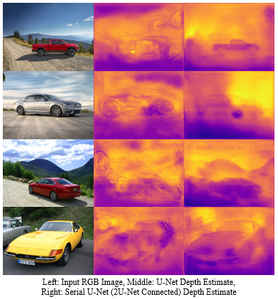

# depth-estimation
Practical Depth Estimation with Image Segmentation and Serial U-Nets




```
depth-estimation
|   depth_estimation_nunet.py <--- main file
|	depth_estimate.png
|   inference_timer.py
|   prediction_comparison.py
|   README.md
|   requirements.txt
|
+---data_extraction
|       pickle_kitti_dataset.py
|       pickle_nyu_dataset.py
|       save_to_file_nyu.m
|
+---models
|       losses.py
|       models.py
|       unet.py
|
+---utils
|       deep_utils.py
|       image_utils.py
|       video_stream.py
|
\---visualization
        conv_visualization.py
```
### Instructions
```
git clone https://github.com/mech0ctopus/depth-estimation.git
pip install -r requirements.txt
python depth_estimation_nunet.py #Train & evaluate depth estimation neural network

#To run live depth estimation on webcam video stream
#Download & extract pre-trained weights from link below
cd utils
python video_stream.py
```
### Pre-trained Weights & Models
[Download Pre-trained Weights & Models](https://mega.nz/#!nhViiYJC!1spTMi9gX8sSFM4CXL0FvViCTowRGz44J9FvFg7aMxs)

### Datasets
- [FieldSAFE](https://vision.eng.au.dk/fieldsafe/)
- [KITTI](http://www.cvlibs.net/datasets/kitti/eval_depth.php?benchmark=depth_prediction)
- [NYU Depth Dataset V2](https://cs.nyu.edu/~silberman/datasets/nyu_depth_v2.html)
